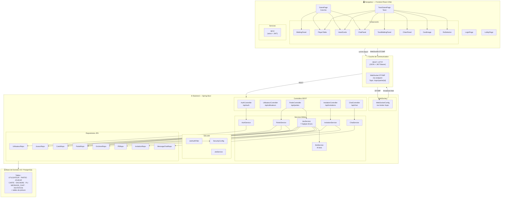

# Schéma de l'Architecture de l'Application

## Flux principaux

| Action | Protocole | Endpoint |
|---|---|---|
| Login / Register | REST POST | `/api/auth/login`, `/api/auth/register` |
| Créer / rejoindre une partie | REST POST | `/api/parties`, `/api/parties/{id}/rejoindre` |
| Jouer une carte | REST POST | `/api/parties/{id}/jouer` |
| Faire une enchère | REST POST | `/api/parties/{id}/enchere` |
| Recevoir la mise à jour d'état | WebSocket STOMP | `/topic/partie/{id}` |
| Envoyer un message chat | REST POST | `/api/chat/{partieId}` |
| Inviter un joueur | REST POST | `/api/invitations` |

## Stack technique

| Couche | Technologie |
|---|---|
| Frontend | React 18, Vite, STOMP.js |
| Backend | Spring Boot 3, Spring Security, Spring Data JPA |
| Authentification | JWT (JSON Web Token) |
| Temps réel | WebSocket + STOMP |
| Base de données | H2 (dev) / PostgreSQL (prod) |
| ORM | Hibernate / JPA |
