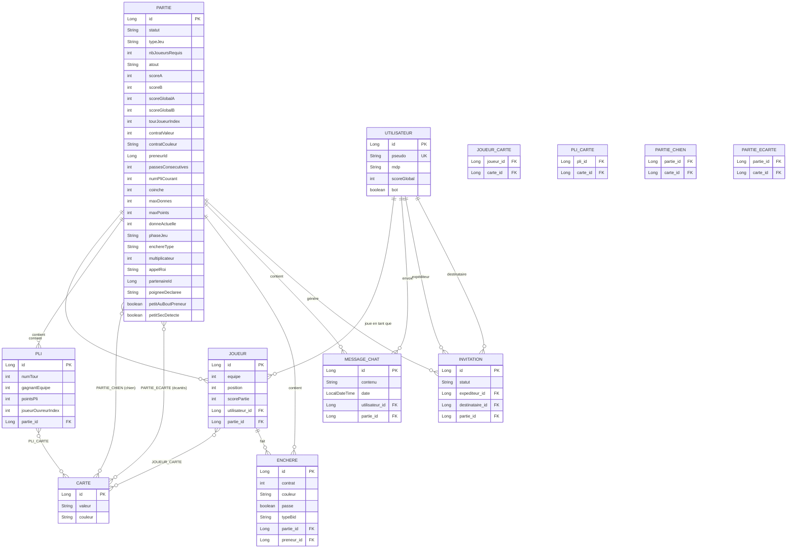

# Schéma de la Base de Données

## Tables de jointure Many-to-Many

| Table | Description |
|---|---|
| `joueur_carte` | Cartes en main d'un joueur |
| `pli_carte` | Cartes jouées dans un pli |
| `partie_chien` | Cartes du chien (Tarot) |
| `partie_ecarte` | Cartes écartées par le preneur (Tarot) |
