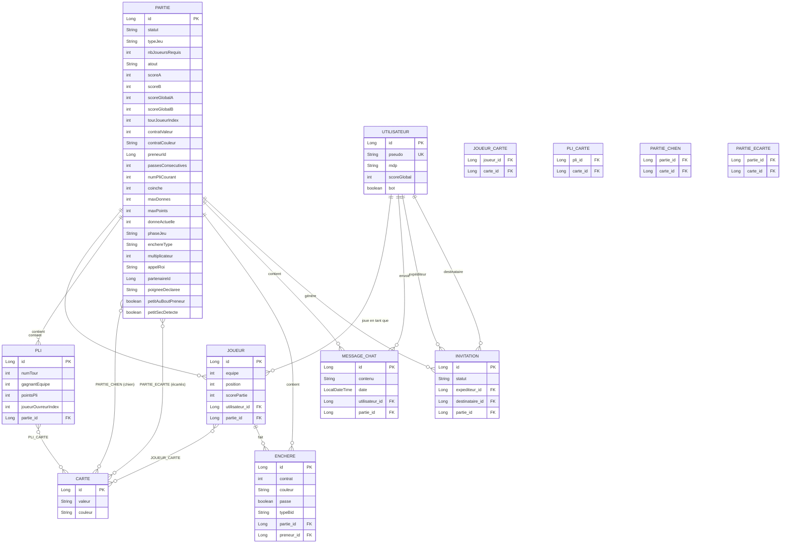
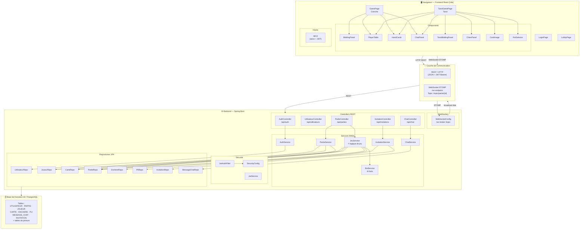

# Schémas du Projet Appliweb

## 1. Schéma de la Base de Données

---

## 2. Schéma de l'Architecture de l'Application

---

## Résumé des flux principaux

| Action | Protocole | Endpoint |
|---|---|---|
| Login / Register | REST POST | `/api/auth/login`, `/api/auth/register` |
| Créer / rejoindre une partie | REST POST | `/api/parties`, `/api/parties/{id}/rejoindre` |
| Jouer une carte | REST POST | `/api/parties/{id}/jouer` |
| Faire une enchère | REST POST | `/api/parties/{id}/enchere` |
| Recevoir la mise à jour d'état | WebSocket STOMP | `/topic/partie/{id}` |
| Envoyer un message chat | REST POST | `/api/chat/{partieId}` |
| Inviter un joueur | REST POST | `/api/invitations` |
